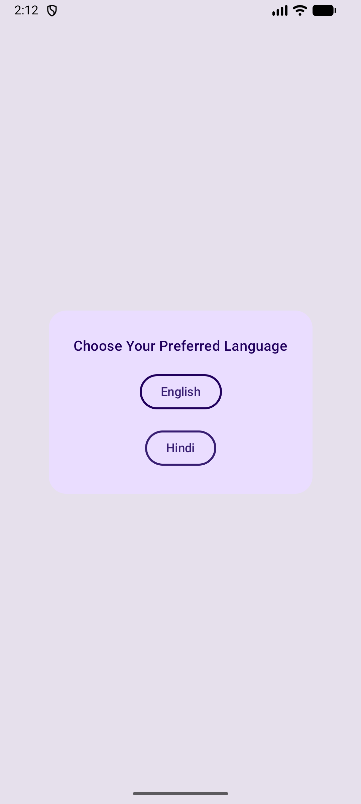
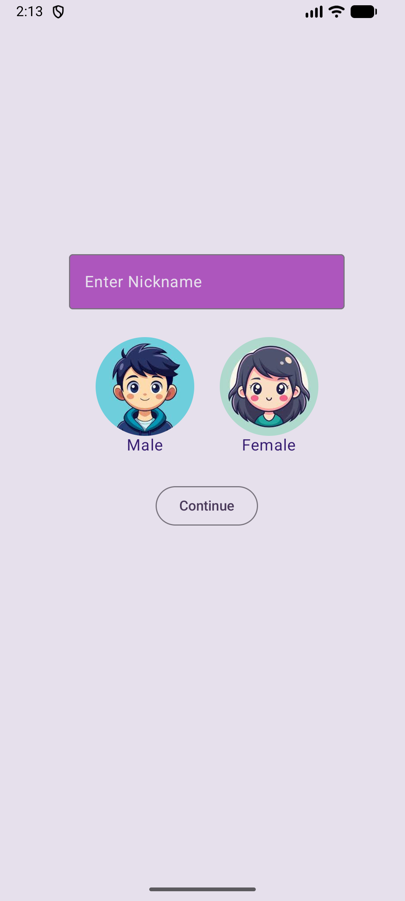
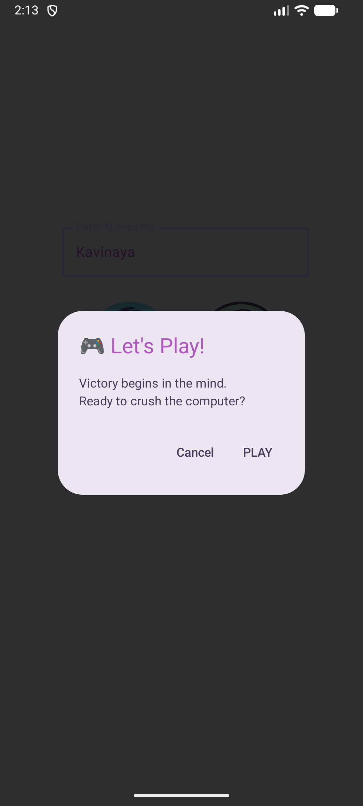
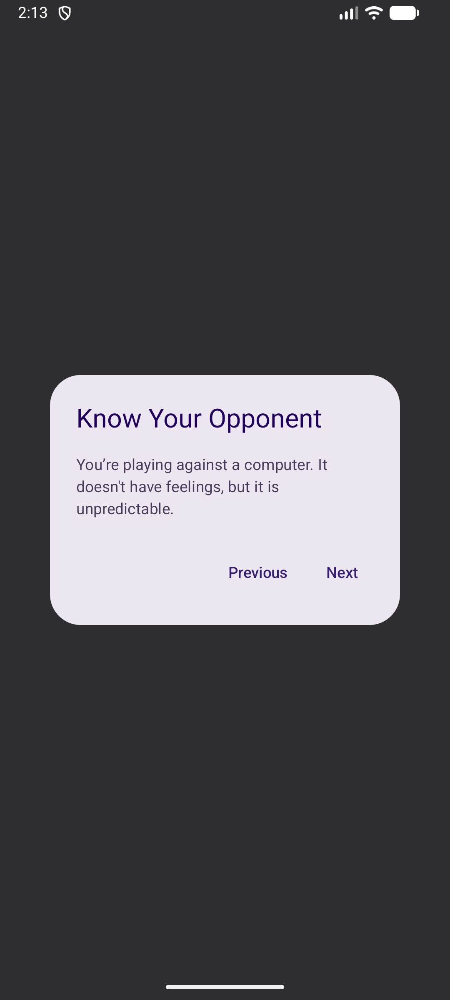
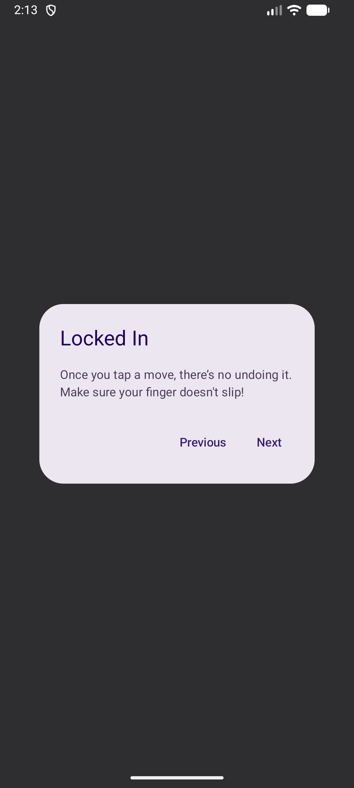
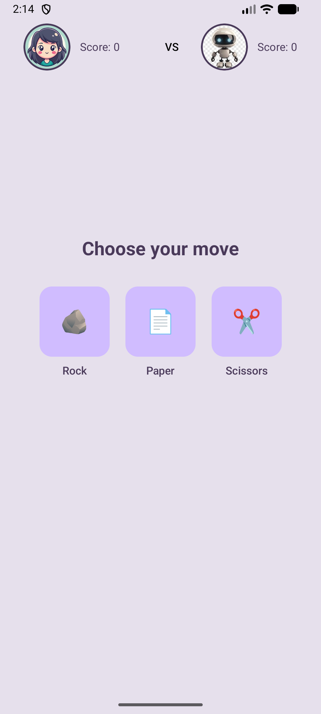
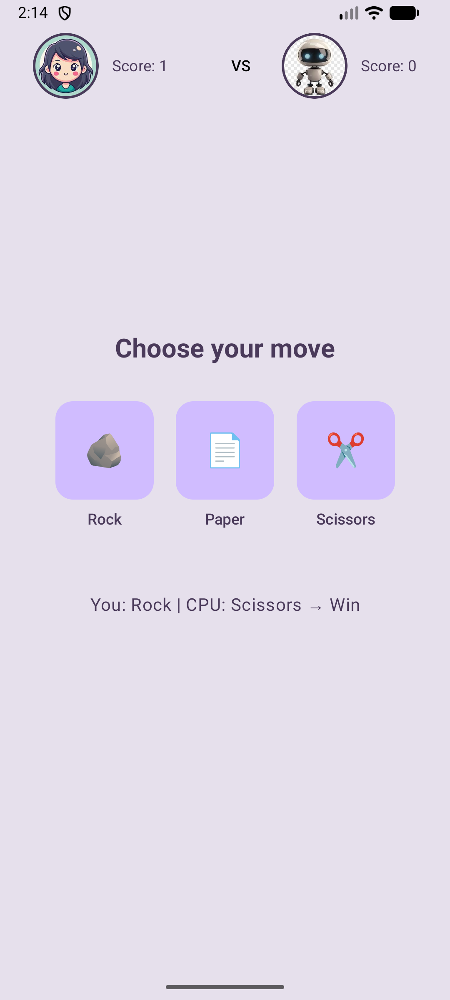

# 🪨📄✂️ Rock Paper Scissor - Android Compose

A modern, interactive Rock Paper Scissors game built using **Jetpack Compose**. This project showcases a complete user flow, custom animations, and clean architecture.

## ✨ Features
* **Full Navigation Flow:** Home ➔ Language ➔ Profile ➔ Rules ➔ Gameplay.
* **Profile Customization:** Save your nickname and choose between Male/Female avatars.
* **Shared State:** Uses a single ViewModel to carry user data across all screens.
* **Animated UI:** Smooth button scaling and color transitions.
* **Interactive Rules:** A step-by-step guide before you start the game.

## 📸 Screenshots

### 🟢 App Setup & Profile
| Home | Language | Profile | Selection |
| :---: | :---: | :---: | :---: |
|  |  |  |  |

### 🟡 Rules & Start
| Start Prompt | Rule Page 1 | Rule Page 2 |
| :---: | :---: | :---: |
|  |  |  |

### 🔴 Gameplay Action
| Match 1 | Match 2 | Match 3 | Result |
| :---: | :---: | :---: | :---: |
|  |  |  |  |

---

## 🛠️ Tech Stack
- **Language:** Kotlin
- **UI Framework:** Jetpack Compose (Material 3)
- **Navigation:** Jetpack Navigation Compose
- **Architecture:** MVVM (Model-View-ViewModel)
- **Dependency Management:** Version Catalog (`libs.versions.toml`)

---

## 🏗️ Project Structure
```text
com.example.rockpaperscissor
├── navigation
│   ├── Screens.kt          # Route definitions (Sealed Class)
│   └── AppNavigation.kt    # NavHost & Navigation Logic
├── ui.screens
│   ├── HomeScreen.kt       # Welcome screen with animations
│   ├── LanguageChoose.kt   # Language selection logic
│   ├── ProfileScreen.kt    # User info & Avatar selection
│   ├── RulesScreen.kt      # Interactive rules dialog
│   └── GameScreen.kt       # Core game engine UI
├── viewmodel
│   └── GameViewModel.kt    # Handling game logic & StateFlow
